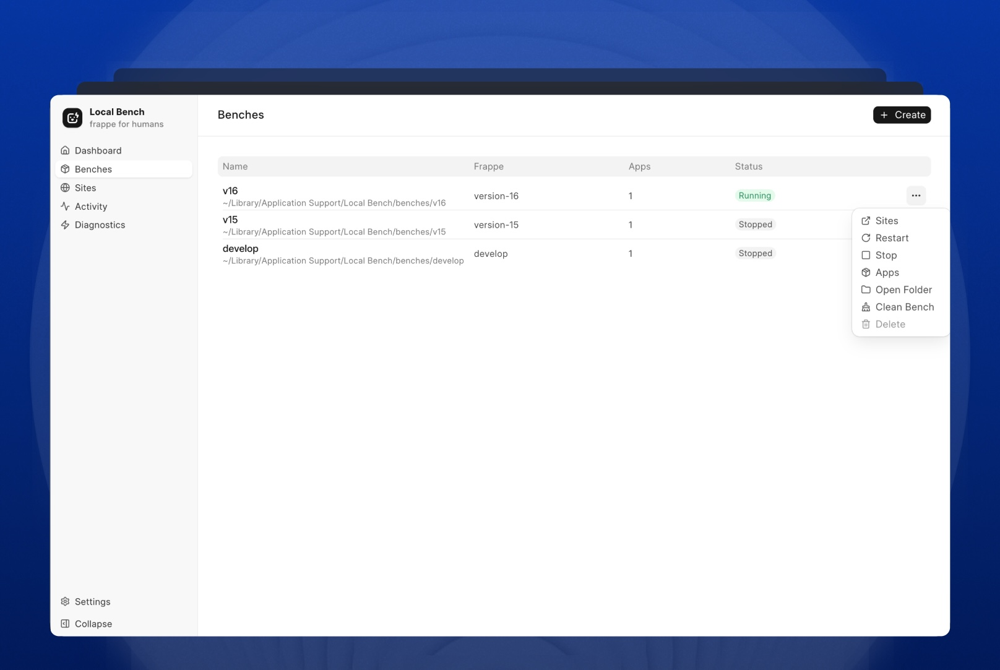

# Frappe Local

Frappe Local is a cross-platform desktop app that lets anyone create local Frappe benches and sites visually without Docker setup, dependency management, or terminal commands.



## Status

> [!CAUTION]
> Project is currently experimental and under active development.

## Installation

### macOS

#### Download
Download the latest release .dmg directly from the from [releases](https://github.com/lubusIN/frappe-local/releases). After download open and drag the app to the applications folder.

#### Unblock Gatekeeper
Apple blocks apps not from Mac App Store or signed by trusted developers. Open terminal and run the following command:

```shell
xattr -rd com.apple.quarantine /Applications/Frappe\ Local.app
```
this will remove the quarantine attribute from the app and you can open it normally.

## First Bench Creation

The first bench creation on MaCOS or Windows initializes a dedicated Podman virtual machine and downloads its Linux image from `quay.io`. Depending on the connection, this can take several minutes. Keep Frappe Local open until setup completes.

If setup fails, open **Diagnostics**, run the checks, and use **Fix**. The diagnostic error includes the underlying Podman output, such as blocked downloads, Gatekeeper restrictions, or missing VM helpers.

## Local HTTPS

Frappe Local uses Caddy to provide HTTPS for `*.localhost` sites. On first use, macOS or Windows may ask for permission to trust the Frappe Local certificate authority. If permission is denied or the trust store is unavailable, Frappe Local uses HTTP automatically instead of opening a site with an invalid certificate.

## Development

### Tech stack:
- Electron + Electron Forge
- Vue 3 + Vite
- TypeScript
- Frappe UI (with Tailwind CSS)
- Podman (Dedicated VM for Frappe containers)
- Caddy (Local HTTPS reverse proxy)

### Prerequisites:
- Node.js (tested with Node 24)
- npm

### Getting Started
#### Install dependencies:

```bash
npm install
```

#### Run in development:

```bash
npm start
```

### App Catalog

Frappe Local dynamically fetches its list of available Frappe apps from the [Frappe Brewery](https://frappe-brewery.pages.dev/) (`https://frappe-brewery.pages.dev/index/apps.json`). The registry is automatically downloaded into the `bin/` directory as a build asset during `npm install` and is parsed at runtime. It is excluded from version control.

## Scripts

- `npm start` - launch Electron app in development mode
- `npm run lint` - run ESLint
- `npm run lint:fix` - auto-fix lint issues where possible
- `npm run typecheck` - run TypeScript checks
- `npm run test` - run Vitest suite
- `npm run package` - package the app without creating installers
- `npm run make` - create platform distributables
- `npm run release:make` - build and validate platform release artifacts
- `npm run precommit:check` - run lint, typecheck, and tests
- `npm run icons:generate` - auto-generate platform icons
- `npm run dev:reset-state` - factory reset development environment

## Project Structure

- `src/main` - Electron main process
- `src/main/preload.ts` - preload bridge
- `src/renderer` - Vue renderer app
- `src/shared` - shared contracts/types between processes
- `tests` - unit/integration tests

## Meet Your Artisans

[LUBUS](https://lubus.in/?utm_source=github&utm_medium=open-source&utm_campaign=frappe-local) is a web design agency based in Mumbai.

<a href="https://cal.com/lubus">

</a>

## License

Frappe Local is open-sourced licensed under the [MIT License](LICENSE).
