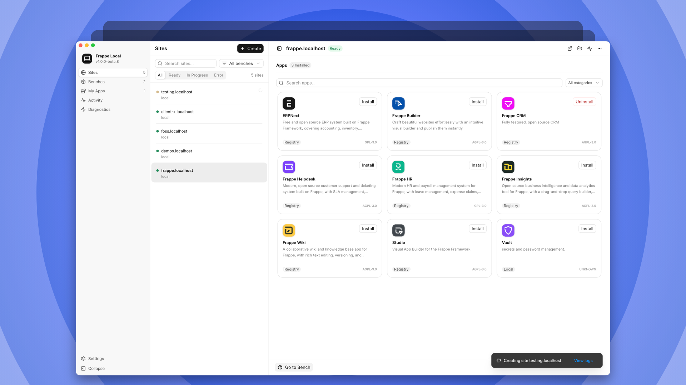

<p align="center"></p>



[](https://github.com/lubusIN/frappe-local/actions/workflows/release.yml) [](https://github.com/lubusIN/frappe-local/actions/workflows/dev.yml)

# Frappe Local

Frappe Local is a cross-platform desktop app that lets anyone create local Frappe benches and sites visually without Docker setup, dependency management, or terminal commands.

## Status

> [!CAUTION]
> Project is currently under active development.

## System Requirements

Frappe benches and app asset builds run inside Linux containers. Some apps with large frontend builds, such as Wiki, require substantially more memory than a basic Frappe bench.

### Hardware

| Resource | Minimum | Recommended |
| --- | --- | --- |
| Memory | 8 GB RAM | 16 GB RAM for multiple benches or frontend-heavy apps |
| CPU | 4 cores with hardware virtualization | 6 or more cores |
| Storage | 20 GB free SSD space | 40 GB or more for multiple benches and apps |

Systems with less than 8 GB RAM are not supported. On macOS and Windows, Frappe Local configures its container environment to use approximately 75% of host memory while leaving memory available for the operating system.

### Platform

- **macOS:** Apple Silicon or Intel Mac with hardware virtualization available.
- **Windows:** 64-bit Windows with hardware virtualization support. Frappe Local detects whether WSL2 and Virtual Machine Platform are ready and provides an in-app setup flow when they need to be enabled.

### Network

An internet connection is required during initial setup and when installing apps. The network must allow access to:

- `quay.io` for the Podman machine image
- Frappe and app Git repositories, including `github.com`
- npm, Yarn, Python, and system package registries used by selected apps

Corporate proxies, VPNs, firewalls, or antivirus software may need exceptions for Frappe Local, Podman, WSL, and the required registries.

### Optional Development Tools

- Visual Studio Code with the **Dev Containers** extension is required only for the **Open in Dev Container** feature.
- Git and other Frappe build dependencies run inside the managed container and do not need to be installed separately on the host.

## Installation

### macOS

#### Download
Download the latest release .dmg directly from [releases](https://github.com/lubusIN/frappe-local/releases). Pick the file that matches your macOS version/Architecture:
- Apple Silicon (M1/M2/M3...): Frappe.Local-*-arm64.dmg
- Intel (Core i5/i7/i9...): Frappe.Local-*-x64.dmg

After download open and drag the app to the applications folder.

#### Unblock Gatekeeper
Apple blocks apps not from Mac App Store or signed by trusted developers. Open terminal and run the following command:

```shell
xattr -rds com.apple.quarantine /Applications/Frappe\ Local.app
```
this will remove the quarantine attribute from the app and you can open it normally.

### Windows

#### Download
Download the latest release .exe directly from [releases](https://github.com/lubusIN/frappe-local/releases). Pick the file that matches your Windows architecture (`x64` or `arm64`).

#### Unblock Windows SmartScreen
Windows blocks apps that are not digitally signed. To bypass the SmartScreen block, open PowerShell in your downloads folder and run the following command on the installer (replace the filename if necessary):

```powershell
Unblock-File -Path ".\Frappe Local Setup-*.exe"
```
this will remove the "Mark of the Web" from the file so you can install it normally. Alternatively, right-click the file -> **Properties** -> check **Unblock** -> **Apply**.

> [!WARNING]
> Even after unblocking, Windows Defender Antivirus may quarantine the extracted `.exe` after installation. If your desktop shortcut is broken (blank white icon) and throws a *"Missing Shortcut"* error, please add an exclusion for `C:\Program Files\frappe-local` in your Windows Security settings and run the installer again.


## First Bench Creation

The first bench creation on macOS or Windows initializes a dedicated Podman virtual machine and downloads its Linux image from `quay.io`. Depending on the connection, this can take several minutes. Keep Frappe Local open until setup completes.

If setup fails, open **Diagnostics**, run the checks, and use **Fix**. The diagnostic error includes the underlying Podman output, such as blocked downloads, Gatekeeper restrictions, or missing VM helpers.

## Local HTTPS

Frappe Local uses Caddy to provide HTTPS for `*.localhost` sites. On first use, macOS or Windows may ask for permission to trust the Frappe Local certificate authority. If permission is denied or the trust store is unavailable, Frappe Local uses HTTP automatically instead of opening a site with an invalid certificate.

## Development

### Tech stack:
- Electron + Electron Forge
- Vue 3 + Vite
- TypeScript
- Frappe UI (with Tailwind CSS)
- Podman (Dedicated VM for Frappe containers)
- Caddy (Local HTTPS reverse proxy)

### Prerequisites:
- Node.js (tested with Node 22)
- npm

### Getting Started
#### Install dependencies:

```bash
npm install
```

#### Run in development:

```bash
npm start
```

### App Catalog

Frappe Local dynamically fetches its list of available Frappe apps from the [Frappe Brewery](https://frappe-brewery.lubus.in/) (`https://frappe-brewery.lubus.in/index/apps.json`). The registry is automatically downloaded into the `bin/` directory as a build asset during `npm install` and is parsed at runtime. It is excluded from version control.

## Scripts

- `npm start` - launch Electron app in development mode
- `npm run lint` - run ESLint
- `npm run lint:fix` - auto-fix lint issues where possible
- `npm run typecheck` - run TypeScript checks
- `npm run test` - run Vitest suite
- `npm run release` - build and validate platform release artifacts
- `npm run icons:generate` - auto-generate platform icons
- `npm run dev:reset-state` - factory reset development environment

## Project Structure

- `src/main` - Electron main process
- `src/main/preload.ts` - preload bridge
- `src/renderer` - Vue renderer app
- `src/shared` - shared contracts/types between processes
- `tests` - unit/integration tests

## Meet Your Artisans

[LUBUS](https://lubus.in/?utm_source=github&utm_medium=open-source&utm_campaign=frappe-local) is a web design agency based in Mumbai.

<a href="https://cal.com/lubus">

</a>

## License

Frappe Local is open-sourced licensed under the [MIT License](LICENSE).
